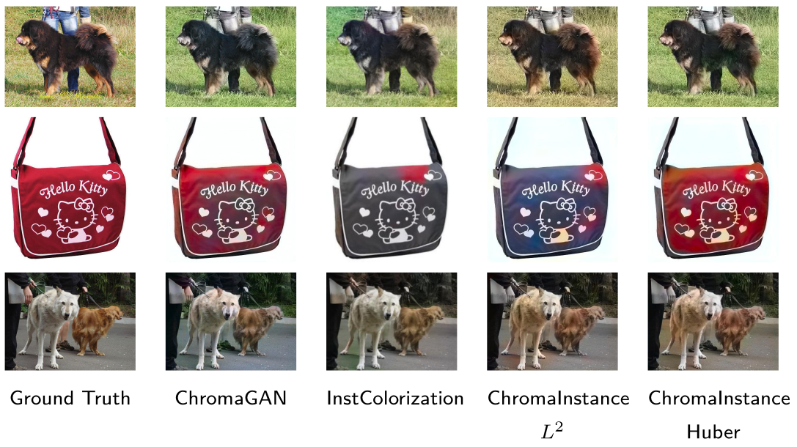
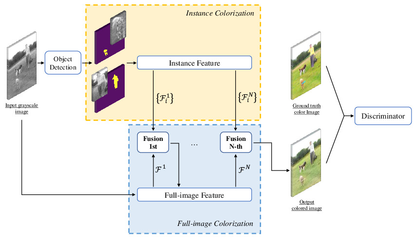
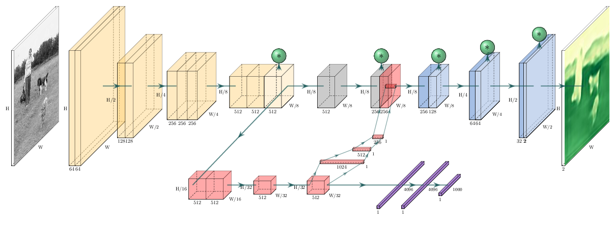
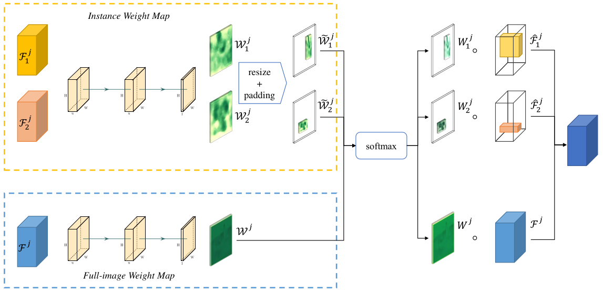

# Chroma Instance - Colorizing Grayscale Images

Project report: see [realease](//github.com/owen8877/chroma-instance/releases/tag/report).

## Feature

- Combines the object detection and the GAN structure for realistic color generation. 
- Encoder-decoder structure for the full-image level as well as the instance level. 
- Object features are merged back into the full-image feature. 
- WGAN design for better training performance.

## Network Design

**Overview**

**Generator**

**Fusion Module**

